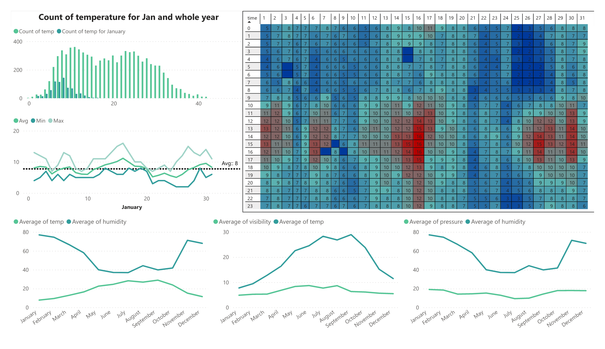
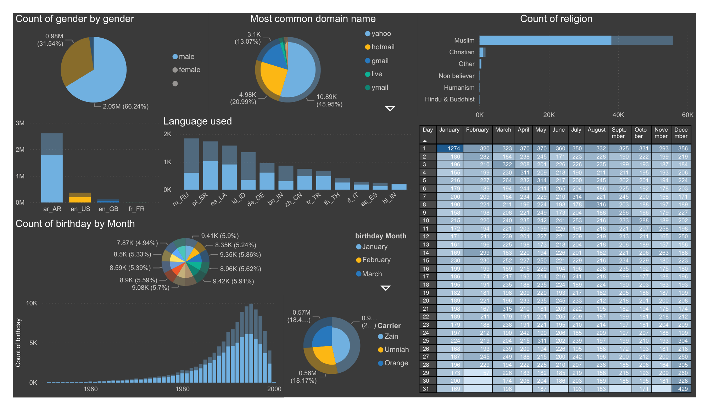
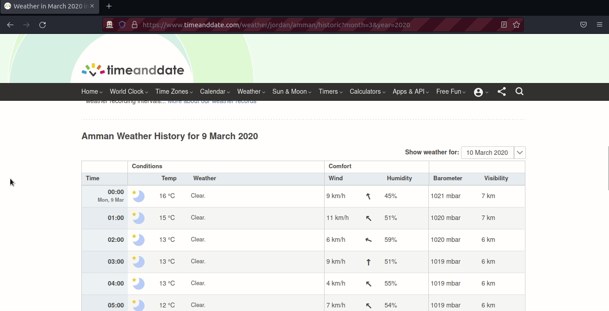

<link rel="stylesheet" href="style.css">

<!-- ...................................................................................................... first main div -->

<div class="card">
<br>
<h1><a href="https://github.com/MohamedSuwan/Weather-Data">Historical Weather Data Analysis</a></h1>

<h3>- Web Scraping: scraping the historical hourly data from a website using
Selenium
- Data cleansing: cleaning, modifying using regular expression, and
converting the data into a CSV file for better handling
- Data Visualization: more cleaning and analysis of the data to get the
useful data for visualization and reporting using pandas and Matplotlib
- Power BI Dashboard: telling the story through visuals
<br>
autoamtion like controling the computer, making a macro-like procedures.
    </h3>

<!-- ....................................................................................... sub div 1.1 -->
  <center>  
      
<div class="cardimg">
  
  <iframe src="notebook/data Visualization.html" class="thumbnail" title="Weather Notebook" width="100%" height="350">
</iframe>
  <div class="container">
    <h4><b>Jupyter Notebook</b></h4> 
      <h4><b>Hover or Click to Enlarge and Scroll Through the Notebook</b></h4>
  </div>
</div>
      <br>
    <br>
 <!-- ..................................................................................... sub div 1.2 -->
    
<div class="cardimg">
  
  <div class="container">
    <h4><b>Power BI Desktop View</b></h4> 
  </div>
</div>
    <br>
    <br>
      
 <!-- ...................................................................................... sub div 1.3 -->
      
      
 <div class="cardimg">
  
  <div class="container">
    <h4><b>Power BI Android View</b></h4> 
  </div>
</div>
    <br>
    <br>
    </center>
    <br>
    <br>
</div>
    

<br>
<br>
<hr>
<br>
<br>


<!-- ...................................................................................................... second main div -->

<div class="card">
    <br>
<h1><a href="https://github.com/MohamedSuwan/leaked-FB-data-analysis">Leaked Facebook Data Analysis</a></h1>

<h3>- 
On April 2021 more than half a billion Facebook user's data have been leaked.
around three million belong to Jordanians.

this repo was made to analyze the data, the data was in a good clean shape, just required some touches and modification.

the analysis will not show sensitive data like the emails or phone numbers, just a simple analysis like phone carrier,email domain,religion and gender.

with a Power BI Dashboard
</h3>

 <!-- ...................................................................................... sub div 2.1 -->

      <center>  
      
<div class="cardimg">
  
  <iframe src="notebook/Jordan FB analysis.html" class="thumbnail" title="Facebook notebook" width="100%" height="350">
</iframe>
  <div class="container">
    <h4><b>Jane Doe</b></h4> 
    <p>Interior Designer</p> 
  </div>
</div>
      <br>
    <br>
    
  <!-- ...................................................................................... sub div 2.2 -->
          
   <div class="cardimg">
  
  <div class="container">
    <h4><b>Jane Doe</b></h4> 
    <p>Interior Designer</p> 
  </div>
</div>
    <br>
    <br> 
    </center>

<br>
    </div>
   
   <br>
 
 <hr>
 <!-- ...................................................................................................... third main div -->
 
 <div class="card">
    <br>
<h1><a href="https://github.com/MohamedSuwan/codewars">Python</a></h1>

<h3>- 
Solutions to problems “katas” from Codewars website, the solutions are written in
Python. relied on libraries and researching to come up with solutions. Used
mathematical theorems, generators, list comprehension, dictionaries, and one-
liners “Pythonic way”
    

</h3>
 <br>

<br>
    

    
</div>
<br>

```python
def is_triangle(a, b, c):
    tl=(sorted([a,b,c]))
    if not(any(tl)>1):
        if tl[0]+tl[1]>tl[2]:
            return True
        else:
            return False
    else:
        return False
```
The above code is a solution for the triangle inequality theorem which describes the relationship between the three sides of a triangle. According to this theorem, for any triangle, the sum of lengths of two sides is always greater than the third side

<br>

<hr>
<br>
<br>
<!-- ...................................................................................................... fourth main div -->
<div class="card">
    <br>
<h1><a href="https://github.com/MohamedSuwan/Web-Scraping-Automation">Web Scraping and Automation</a></h1>

<h3>scraping different elements from the web, cleaning and organizing the data in different ways and formats.
<br>
autoamtion like controling the computer, making a macro-like procedures.
    </h3>
<center>
<!-- ...................................................................................... sub div 4.1 -->
<div class="cardimg">
  
  
  <div class="container">
    <h4><b>Jane Doe</b></h4> 
    <p>Interior Designer</p> 
  </div>
 
</div>
    </center>
   
    <br>
    <br>
</div>
     


<br>
<br>
<br>
<br>
                        
