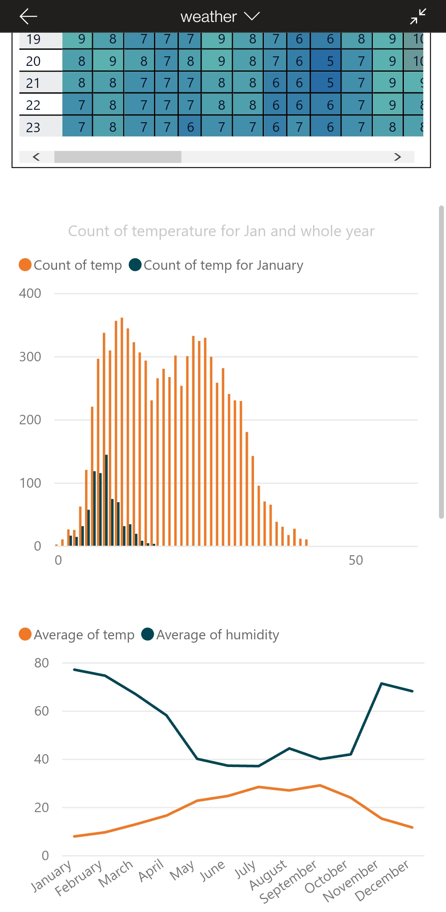

[Historical Weather Data Analysis](https://github.com/MohamedSuwan/Weather-Data)

• Web Scraping: scraping the historical hourly data from a website using
Selenium
• Data cleansing: cleaning, modifying using regular expression, and
converting the data into a CSV file for better handling
• Data Visualization: more cleaning and analysis of the data to get the
useful data for visualization and reporting using pandas and Matplotlib
• Power BI Dashboard: telling the story through visuals



...........................................................................................................................................................

[#Leaked Facebook Data Analysis](https://github.com/MohamedSuwan/leaked-FB-data-analysis)

# leaked-FB-data-analysis
on April 2021 more than half a billion Facebook user's data have been leaked.
around three million belong to Jordanians.

this repo was made to analyze the data, the data was in a good clean shape, just required some touches and modification.

the analysis will not show sensitive data like the emails or phone numbers, just a simple analysis like phone carrier,email domain,religion and gender.

with a Power BI Dashboard


...........................................................................................................................................................


Solutions to problems “katas” from Codewars website, the solutions are written in
Python. relied on libraries and researching to come up with solutions. Used
mathematical theorems, generators, list comprehension, dictionaries, and one-
liners “Pythonic way”

```python
s = "Python syntax highlighting"
for i in range 20:
  print s
```

---
***
___
[#Web Scraping and Automation](https://github.com/MohamedSuwan/Web-Scraping-Automation)

scraping different elements from the web, cleaning and organizing the data in different ways and formats.

autoamtion like controling the computer, making a macro-like procedures.
